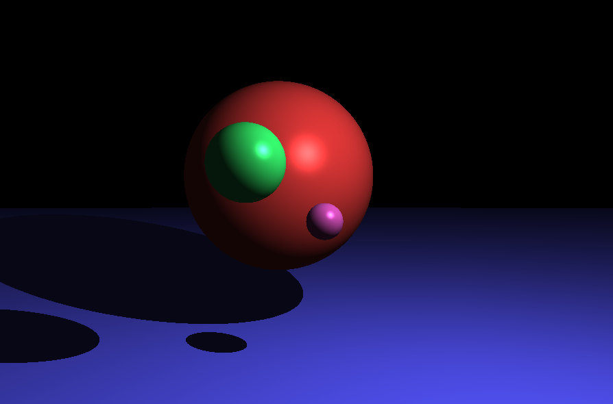

# Ray Tracer
Renderizador em Rust que cria imagens PPM usando a técnica de Ray Tracing e geração de cores com método Blinn-Phong.

Para adicionar suporte à renderização de mais objetos, implementar a `trait SceneObject`.

Instalação do Rust: https://www.rust-lang.org/pt-BR

# Executando o projeto
Esse projeto não possui dependências de libs externas.

Executar:
```
cargo run
```

# Exemplo

As configurações feitas em `src/main.rs` geram a imagem a seguir:


